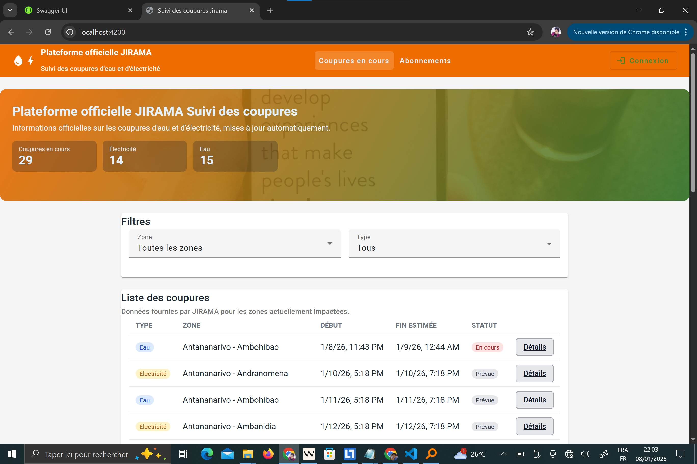
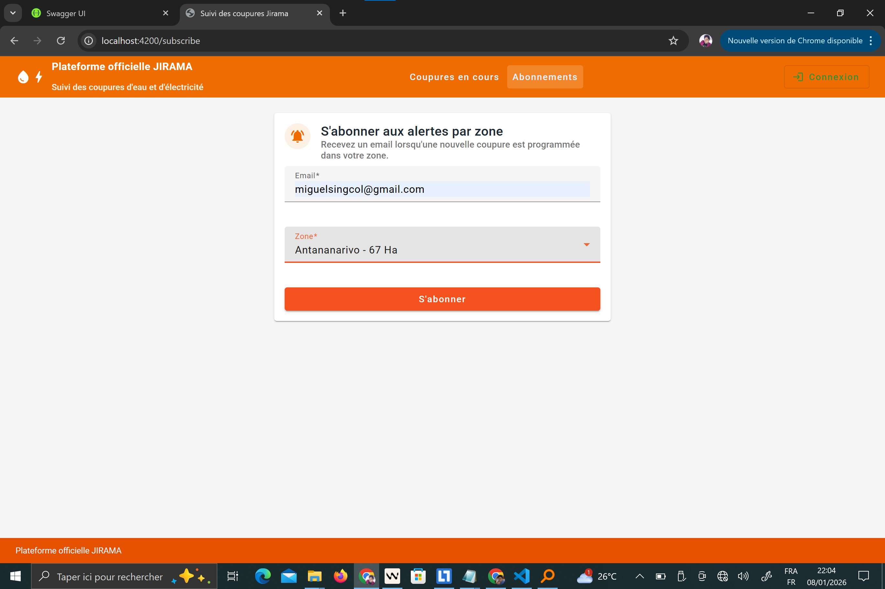
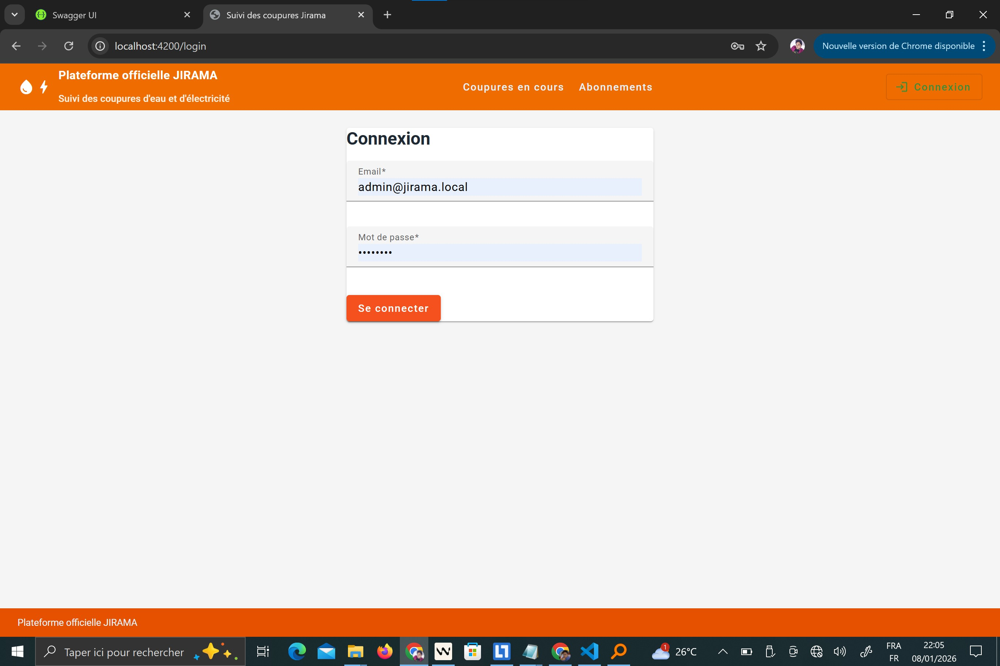
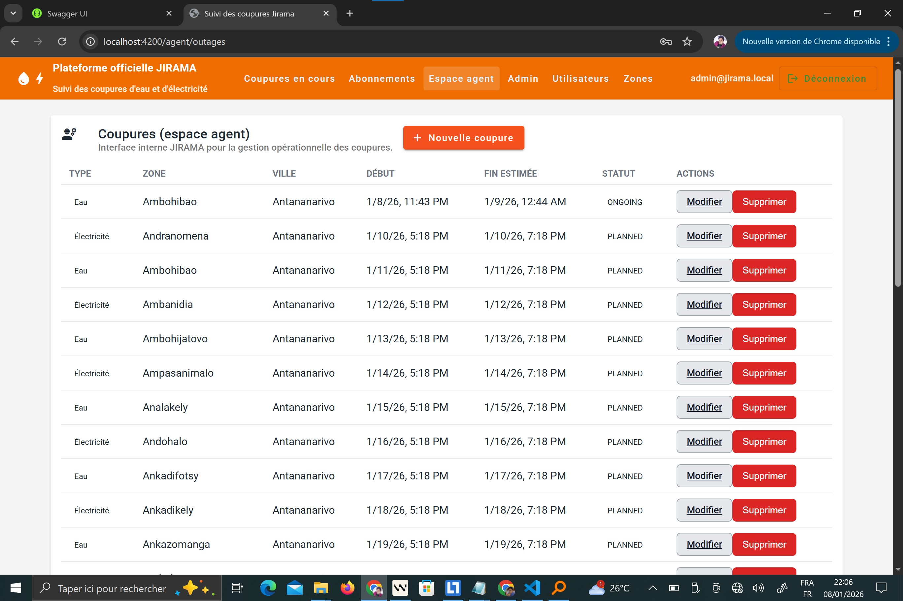
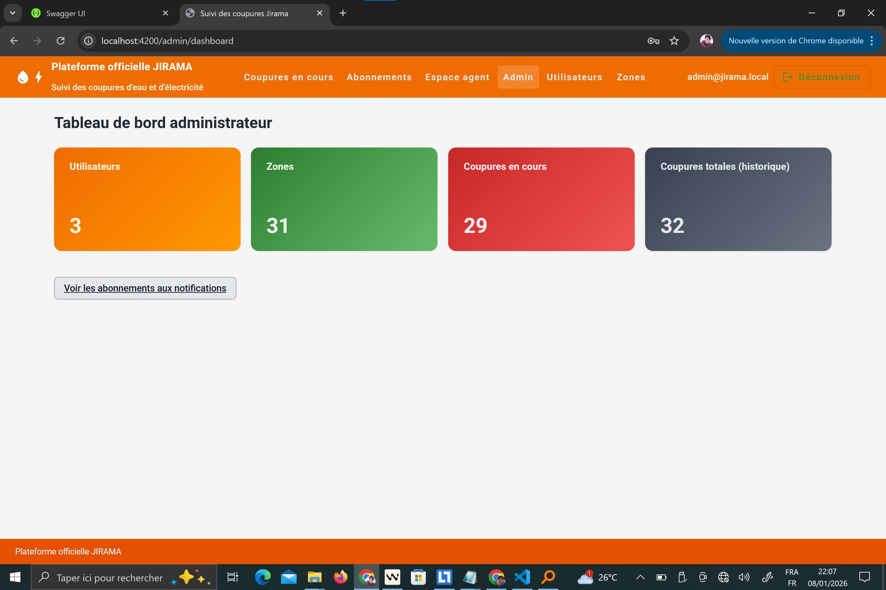
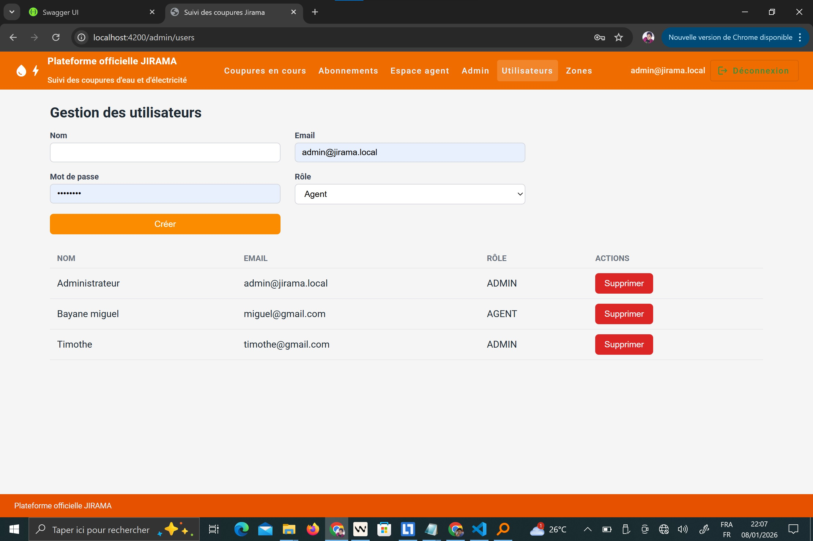
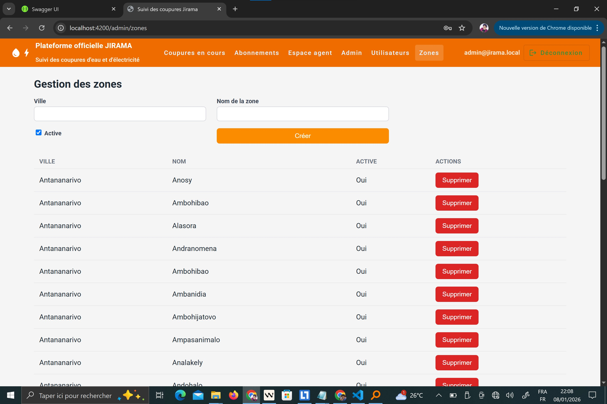
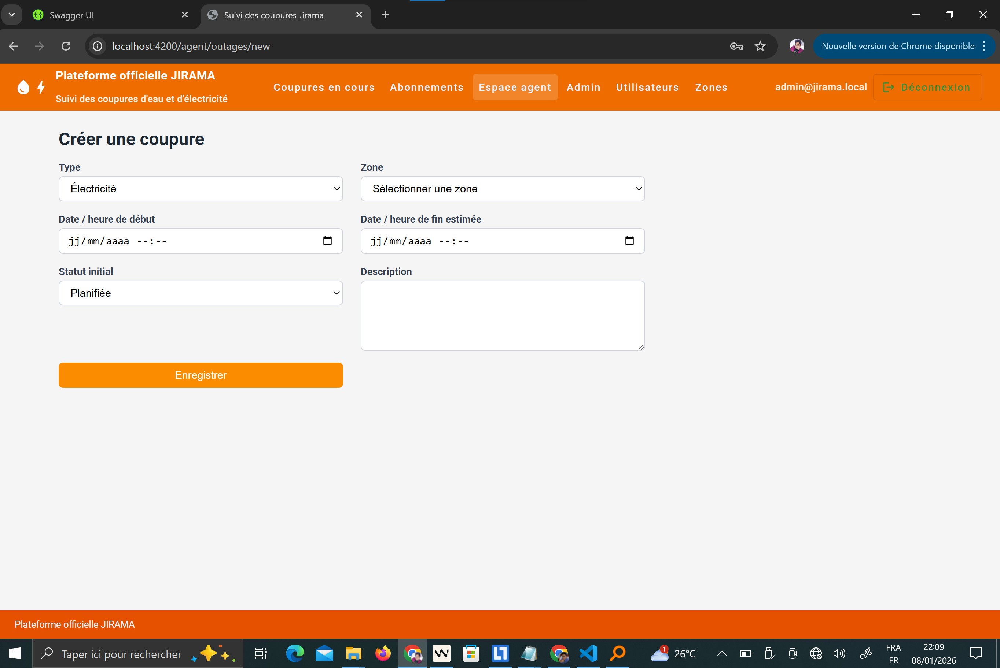
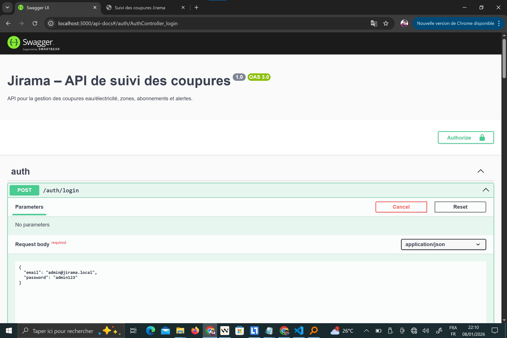
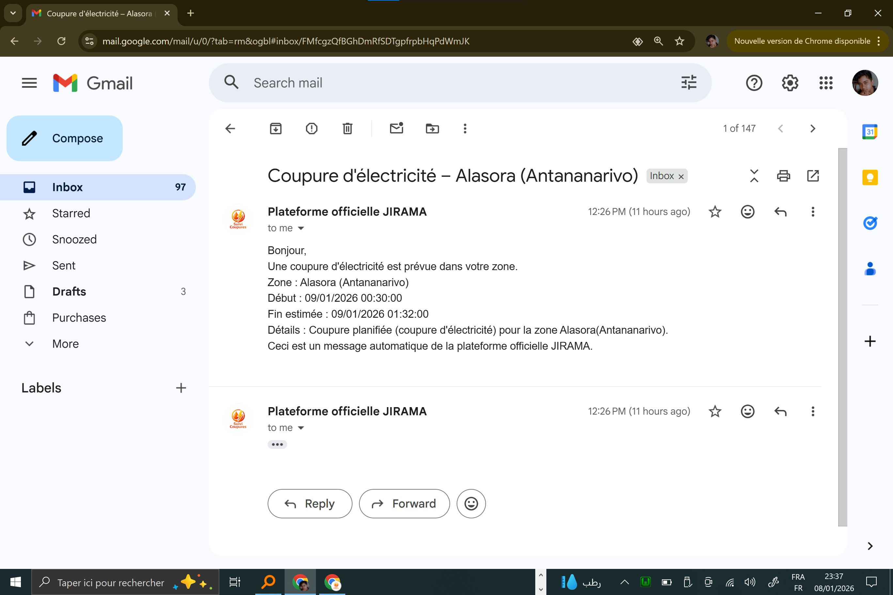

# Outage Alerts MG – projet personnel (inspiré JIRAMA)

> ⚠️ Projet purement **personnel**, inspiré du contexte et du design JIRAMA mais **sans aucun lien officiel** avec la JIRAMA.

Ce projet est une **plateforme complète** de suivi des coupures (électricité / eau) inspirée du contexte JIRAMA, avec :

- **Backend** : API NestJS + TypeORM + SQLite + JWT + rôles + Swagger + cron
- **Frontend** : Angular 17 + Angular Material (UI formulaires) + guards + routing (public / agent / admin)

Il est conçu comme une maquette fonctionnelle pour :

- Centraliser les **coupures planifiées et en cours**
- Permettre aux **agents / admins** de les gérer
- Permettre aux **clients** de consulter les coupures et de **s'abonner par zone**

---

## 1. Architecture générale

Arborescence principale :

- `backend/` : API NestJS
- `frontend/` : SPA Angular

### Backend (NestJS)

Modules principaux :

- `auth` : authentification JWT, login, validation des identifiants
- `users` : gestion des utilisateurs (`ADMIN` / `AGENT`)
- `zones` : gestion des zones géographiques
- `outages` : gestion des coupures (création, mise à jour, statut, historique)
- `subscriptions` : abonnements par email à une zone

Technos & briques :

- **NestJS 10**
- **TypeORM + SQLite** (`jirama.db`, `synchronize: true` pour la démo)
- **JWT** pour sécuriser l'API
- **Guards** : `JwtAuthGuard`, `RolesGuard`
- **Cron** (`@nestjs/schedule`) pour fermer automatiquement les coupures expirées
- **Swagger** pour la documentation API (`/api-docs`)

### Frontend (Angular)

Zones fonctionnelles :

- **Public**
  - Liste des coupures en cours/prévues, avec filtres (zone, type)
  - Détail d'une coupure
  - Formulaire d'abonnement par zone (`/subscribe`)
- **Espace agent**
  - Liste des coupures
  - Création d'une nouvelle coupure
  - Édition complète d'une coupure existante
- **Espace admin**
  - Tableau de bord (statistiques)
  - Gestion des utilisateurs (ADMIN / AGENT)
  - Gestion des zones

Technos & briques :

- **Angular 17**
- **Angular Material 17** (formulaires, boutons, cards)
- **Routing** avec guards (`AuthGuard`, `RoleGuard`)
- **Services HTTP** pour consommer l'API NestJS

---

## 2. Prérequis

- Node.js 18+ recommandé
- npm

---

## 3. Installation des dépendances

Dans un terminal :

```bash
cd "c:\Users\miguel\Desktop\Projet janvier 2026\Jirama"
```

### Backend

```bash
cd backend
npm install
```

### Frontend

```bash
cd ../frontend
npm install
```

---

## 4. Lancement du projet (backend + frontend)

Ouvrez **deux terminaux**.

### Terminal 1 — Backend NestJS

```bash
cd "c:\Users\miguel\Desktop\Projet janvier 2026\Jirama\backend"
npm run start:dev
```

Le backend écoute par défaut sur :

- `http://localhost:3000`
- Documentation Swagger : `http://localhost:3000/api-docs`

### Terminal 2 — Frontend Angular

```bash
cd "c:\Users\miguel\Desktop\Projet janvier 2026\Jirama\frontend"
npm run start
```

Le frontend est accessible sur :

- `http://localhost:4200`

---

## 5. Comptes et rôles

Il existe deux rôles principaux dans l'application :

- **ADMIN** : administrateur (gestion des utilisateurs, zones, accès dashboard)
- **AGENT** : agent JIRAMA (gestion des coupures)

### Compte administrateur par défaut

Au premier démarrage du backend, si aucun utilisateur n'existe, un **compte admin par défaut** est créé :

```json
{
  "email": "admin@jirama.local",
  "password": "admin123"
}
```

Ce compte permet d'accéder à l'espace admin et de créer d'autres utilisateurs (ADMIN ou AGENT).

### Création de comptes agents / admins

- Se connecter avec le compte admin
- Aller sur **"Admin utilisateurs"** (`/admin/users`)
- Remplir le formulaire :
  - Nom
  - Email
  - Mot de passe
  - Rôle : `AGENT` ou `ADMIN`

Les utilisateurs ainsi créés peuvent ensuite se connecter via la page **Login**.

---

## 6. Parcours fonctionnels

### 6.1. Utilisateur public (client / citoyen)

Sans être connecté, un utilisateur peut :

- Consulter les **coupures en cours / prévues** sur la page d'accueil (`/`)
- Voir le **détail** d'une coupure (`/outages/:id`)
- S'abonner aux alertes par zone (`/subscribe`)

#### Abonnement par zone (`/subscribe`)

- Champ **Email**
- Champ **Zone** (liste des zones actives)
- Bouton **"S'abonner"**

Côté backend, un enregistrement est créé dans la table `subscriptions` :

- `userEmail`
- `zoneId`

Lors de la création d'une nouvelle coupure, les abonnés de la zone sont listés et une **notification de console** est générée (extension possible vers email/SMS).

---

### 6.2. Agent JIRAMA

Rôle : `AGENT` (ou `ADMIN`, qui peut aussi agir comme agent).

Fonctionnalités :

- **Liste des coupures** (`/agent/outages`)
  - Vue tableau avec type, zone, ville, dates, statut
  - Bouton **Modifier** pour chaque coupure
  - Bouton **Nouvelle coupure**

- **Création d'une coupure** (`/agent/outages/new`)
  - Type : Eau / Électricité
  - Zone
  - Date/heure de début
  - Date/heure de fin estimée
  - Statut initial (Planifiée / En cours / Rétablie)
  - Description

- **Édition d'une coupure** (`/agent/outages/:id/edit`)
  - Modification **complète** de la coupure : type, zone, dates, statut, description.

L'accès à ces routes est protégé par :

- `AuthGuard` : utilisateur doit être connecté
- `RoleGuard` : rôle `AGENT` ou `ADMIN`

---

### 6.3. Administrateur JIRAMA

Rôle : `ADMIN`.

Fonctionnalités :

- **Tableau de bord** (`/admin/dashboard`)
  - Nombre d'utilisateurs
  - Nombre de zones
  - Nombre de coupures en cours
  - Nombre total de coupures (historique)
  - Cartes colorées pour une meilleure lisibilité

- **Gestion des utilisateurs** (`/admin/users`)
  - Liste des comptes (ADMIN / AGENT)
  - Formulaire de création (nom, email, mot de passe, rôle)
  - Suppression d'utilisateurs

- **Gestion des zones** (`/admin/zones`)
  - Liste des zones (ville, nom, active ou non)
  - Création de nouvelles zones
  - Suppression de zones

L'accès à ces routes est réservé au rôle `ADMIN`.

---

## 7. API & documentation Swagger

L'API backend est documentée via **Swagger** :

- URL : `http://localhost:3000/api-docs`

Vous y trouverez :

- `POST /auth/login` — connexion
- `GET /users`, `POST /users`, `DELETE /users/{id}` — gestion utilisateurs (ADMIN)
- `GET /zones`, `POST /zones`, etc. — gestion zones (ADMIN)
- `GET /outages/current` / `GET /outages/history` — coupures publiques
- `POST /outages` / `PATCH /outages/{id}` — gestion coupures (AGENT/ADMIN)
- `POST /subscriptions` — création d'abonnement par email

Les routes sensibles sont protégées par JWT + rôles.

---

## 8. Cron : fermeture automatique des coupures expirées

Un job cron NestJS tourne **toutes les minutes** :

- Fichier : `backend/src/outages/outages.service.ts`
- Méthode : `autoCloseExpiredOutages()`

Logique :

- Cherche toutes les coupures avec :
  - `endTimeEstimated <= maintenant`
  - `status` ∈ { `PLANNED`, `ONGOING` }
- Met leur statut à `RESTORED`
- Sauvegarde en base.

Ainsi, les coupures « planifiées » ou « en cours » basculent automatiquement en **rétablies** lorsque l'heure de fin estimée est dépassée.

---

## 9. Notes et limites (maquette demo)

- La base SQLite (`jirama.db`) est recréée / mise à jour automatiquement avec `synchronize: true`. Pour un environnement de production, il faudrait passer par des migrations.
- Les **notifications d'abonnement** sont pour l'instant des `console.log`. Une intégration réelle (email / SMS) peut être branchée par-dessus le service `SubscriptionsService`.
- Les tests automatisés ne sont pas encore implémentés (`npm test` retourne un message placeholder).

---

## 10. Résumé

Le projet répond aux objectifs du cahier des charges :

- Backend NestJS complet (auth JWT, rôles, zones, coupures, abonnements, cron, SQLite, Swagger)
- Frontend Angular : partie publique, espace agent, espace admin
- UI formulaires améliorée avec Angular Material et styles globaux cohérents
- Documentation API (Swagger) + ce README pour l'installation et l'architecture

Le tout forme une **plateforme cohérente et exploitable** pour démontrer un système de gestion de coupures type JIRAMA.

---

## 11. Captures d'écran

Quelques aperçus de l'interface (issues du dossier `screenshoots/`) :

- **Accueil public (liste des coupures)**

  

- **Formulaire d'abonnement par zone**

  

- **Page de connexion**

  

- **Espace agent – liste des coupures**

  

- **Tableau de bord administrateur**

  

- **Création d'un compte agent**

  

- **Gestion / ajout de zones**

  

- **Création d'une coupure**

  

- **Documentation API Swagger**

  

- **Exemple de message d'alerte / notification**

  

